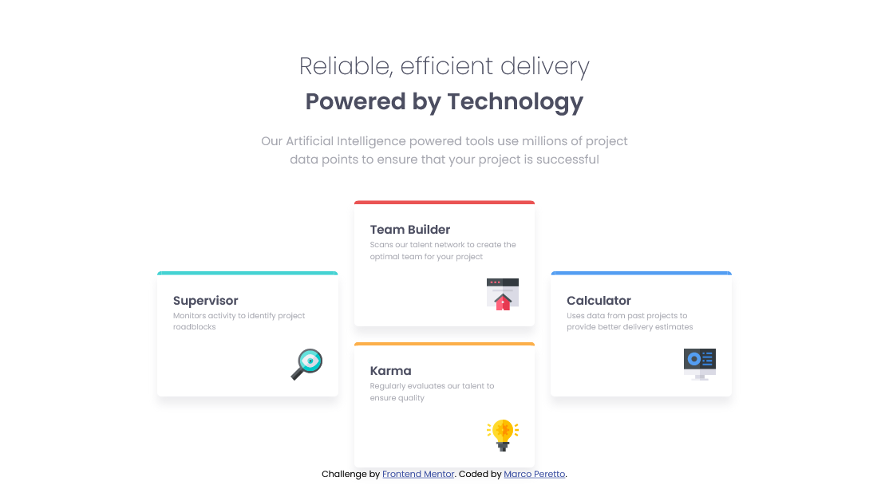

# Frontend Mentor - Testimonials grid section solution

This is a solution to the [Testimonials grid section challenge on Frontend Mentor](https://www.frontendmentor.io/challenges/testimonials-grid-section-Nnw6J7Un7). Frontend Mentor challenges help you improve your coding skills by building realistic projects. 

## Table of contents

- [Overview](#overview)
  - [The challenge](#the-challenge)
  - [Screenshot](#screenshot)
  - [Links](#links)
- [My process](#my-process)
  - [Built with](#built-with)
  - [What I learned](#what-i-learned)
  - [Useful resources](#useful-resources)
- [Author](#author)

## Overview

### The challenge

Users should be able to:

- View the optimal layout for the site depending on their device's screen size

### Screenshot

#### Desktop version:


#### Mobile version:


### Links

- Solution URL: [Solution](https://www.frontendmentor.io/solutions/sass-four-card-feature-using-grid-and-flex-Lsi-Jdfw_)
- Live Site URL: [Live site](https://marcoperetto-four-card-feature-section-challenge.netlify.app/)

## My process

### Built with

- Semantic HTML5 markup
- CSS custom properties
- Flexbox
- CSS Grid
- Mobile-first workflow

### What I learned

Use of @mixin
```scss
@mixin card-child-style($child, $row, $col) {
                &:nth-child(#{$child}) {
                    grid-row: $row;
                    grid-column: $col;
                }
            }

            @include card-child-style(1, 1, 1);
            @include card-child-style(2, 2, 1);
            @include card-child-style(3, 1, 2);
            @include card-child-style(4, 2, 2);

```

### Useful resources

- [CSS Flex Guide](https://css-tricks.com/snippets/css/a-guide-to-flexbox/)
- [CSS Grid Guide](https://css-tricks.com/snippets/css/complete-guide-grid/)

## Author

- Frontend Mentor - [@mperetto](https://www.frontendmentor.io/profile/mperetto)
- Linkedin - [Marco Peretto](https://www.linkedin.com/in/marco-peretto/)
